<p align="center">
  
</p>

<h1 align="center">Restify</h1>

<p align="center">
  <strong>A full-featured API client built into VS Code</strong><br/>
  Send HTTP requests, debug responses, organize collections, and test APIs — without leaving your editor.
</p>

<p align="center">
  <a href="https://marketplace.visualstudio.com/items?itemName=AshishBhavsar.restify-client">
    
  </a>
  
  
  
</p>

---

## At a Glance

| | Feature |
|---|---|
| **REST, GraphQL & WebSocket** | Send requests with full body, header, and auth support |
| **SOAP / WSDL** | Import WSDL services and generate SOAP envelopes |
| **11 Auth Methods** | Bearer, Basic, API Key, OAuth 2.0, JWT, Digest, AWS SigV4, Hawk, NTLM, Inherit |
| **Collections & Folders** | Organize requests with drag-and-drop, nested folders, and collection runner |
| **Environments & Variables** | Reusable `{{variables}}` with secret masking and scope precedence |
| **OpenAPI / Swagger Explorer** | Browse and import Swagger 2.0 and OpenAPI 3.0 specs |
| **Import/Export** | Postman, Insomnia, HAR, cURL, WSDL, .http, OpenAPI, Restify JSON |
| **Code Generation** | 11 languages: cURL, JS, Python, Go, Java, C#, Swift, PHP, PowerShell |
| **Pre/Post Scripts & Tests** | Automate workflows with `pm.test()` assertions and variable extraction |
| **JSON Schema Validation** | Validate responses against JSON Schema (draft-07) |
| **JSONPath Query** | Query JSON responses with JSONPath expressions |
| **File Response Preview** | Inline preview for CSV, Excel, PDF, and plain text |
| **Mock Server** | Spin up a local mock server from your collections |
| **Activity Log** | Real-time request lifecycle events in the bottom panel |

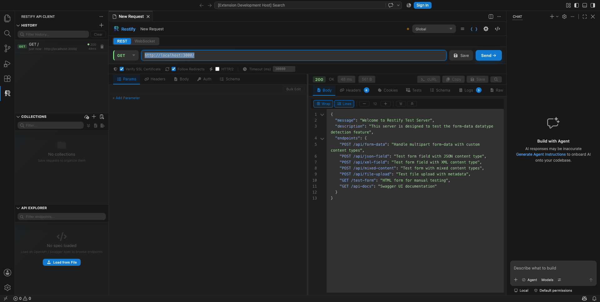

---

## Table of Contents

1. [Getting Started](#getting-started)
2. [Interface Overview](#interface-overview)
3. [Request Builder](#request-builder)
4. [Authentication](#authentication)
5. [Response Viewer](#response-viewer)
6. [Collections](#collections)
7. [Import & Export](#import--export)
8. [OpenAPI / Swagger Explorer](#openapi--swagger-explorer)
9. [Environments & Variables](#environments--variables)
10. [Code Generation](#code-generation)
11. [Pre/Post Scripts & Test Assertions](#prepost-scripts--test-assertions)
12. [Request Chaining](#request-chaining)
13. [Dynamic Variables](#dynamic-variables)
14. [JSON Schema Validation](#json-schema-validation)
15. [JSONPath Query](#jsonpath-query)
16. [SOAP / WSDL](#soap--wsdl)
17. [WebSocket Client](#websocket-client)
18. [Header Presets](#header-presets)
19. [Mock Server](#mock-server)
20. [API Documentation Generation](#api-documentation-generation)
21. [Settings](#settings)
22. [Keyboard Shortcuts](#keyboard-shortcuts)

---

## Getting Started

### Step 1 — Install Restify

Open the **Extensions** panel in VS Code (`Ctrl+Shift+X` / `Cmd+Shift+X`), search for **"Restify"**, and click **Install**.

Alternatively, install directly from the [VS Code Marketplace](https://marketplace.visualstudio.com/items?itemName=AshishBhavsar.restify-client).

### Step 2 — Open Restify

You can open the panel using any of these methods:

1. **Click the Restify icon** in the Activity Bar (the vertical icon bar on the far left)
2. **Command Palette** — press `Ctrl+Shift+P` / `Cmd+Shift+P` and type **"Restify: Open"**
3. A new request tab opens automatically in the main editor area

### Step 3 — Send Your First Request

1. Select an HTTP method from the dropdown (GET is selected by default)
2. Type a URL in the address bar (e.g., `https://jsonplaceholder.typicode.com/posts`)
3. Press **Enter** or click the **Send** button
4. The response appears in the right pane with status, timing, and formatted body

---

## Interface Overview

Restify adds three views to the VS Code sidebar and a request panel in the editor area.

| View | Location | Purpose |
|------|----------|---------|
| **History** | Sidebar | Last 25 executed requests, click to restore |
| **Collections** | Sidebar | Saved requests organized in folders with drag-and-drop |
| **API Explorer** | Sidebar | Browse and import OpenAPI / Swagger specs |
| **Request Panel** | Editor area | Build and send HTTP requests |


> **Tip:** Drag the sidebar wider to see more detail, or collapse individual panels by clicking their header.

---

## Request Builder

### URL & Method

The URL bar is where you enter the endpoint address. The method dropdown sits to its left.

**How to use:**

1. Click the **method dropdown** and select your HTTP method (GET, POST, PUT, DELETE, PATCH, HEAD, OPTIONS). Each method is color-coded for quick recognition.
2. **Type or paste your URL** in the address bar. You can include query parameters directly (e.g., `https://api.example.com/users?page=1&limit=10`).
3. If you have an active environment, type `{{variableName}}` anywhere in the URL — it will be highlighted in green when resolved.
4. Press **Enter** or click **Send** to execute the request.


> **Tip:** You can also paste a cURL command directly — Restify will parse it and fill in the method, URL, headers, and body automatically. Run **"Restify: Paste cURL"** from the Command Palette.

---

### Headers

The Headers tab lets you add, edit, and manage HTTP request headers.

**How to use:**

1. Click the **Headers** tab in the request pane.
2. Click the **+** button or start typing in the empty row to add a new header.
3. **Autocomplete** suggests common header names (`Content-Type`, `Authorization`, `Accept`, etc.) and values (`application/json`, `Bearer`, etc.) as you type.
4. **Toggle any header on/off** by clicking the checkbox next to it — this disables the header without deleting it.
5. **Bulk Edit** — click the bulk edit button to paste multiple headers at once in `Key: Value` format (one per line).
6. **Header Presets** — save and apply reusable header sets from the Presets bar above the table.


> **Tip:** If your request body is JSON, Restify automatically adds `Content-Type: application/json` for you.

---

### Query Parameters

Query parameters let you build URL parameters in a structured table instead of editing the URL directly.

**How to use:**

1. Click the **Params** tab in the request pane.
2. Add key/value pairs in the table rows.
3. The URL bar updates automatically to reflect your parameters.
4. You can also type parameters directly in the URL — they appear in the Params table automatically.
5. **Toggle any parameter on/off** to include or exclude it without deleting.
6. **Bulk Edit** — paste tab/newline-delimited rows from spreadsheets or CSV files directly into the table.

> **Tip:** Both the URL bar and the Params table stay in sync — editing one updates the other.

---

### Request Body

The Body tab lets you define the payload sent with POST, PUT, and PATCH requests.

**How to use:**

1. Click the **Body** tab in the request pane.
2. Select your body format from the dropdown:

| Format | Use Case |
|--------|----------|
| **None** | No body (GET, DELETE) |
| **JSON** | Structured data with syntax highlighting and auto-formatting |
| **XML** | XML-formatted payloads |
| **Text** | Raw text |
| **Form Data** | Key/value pairs with file upload support |
| **URL Encoded** | Standard form submission format |
| **GraphQL** | GraphQL queries and variables |

3. Type or paste your body content in the editor area.
4. Use the **format** button (or `Shift+Alt+F`) to auto-format JSON or XML.
5. Optionally enable **Compress body** (gzip, deflate, or brotli) from the dropdown below the body editor.

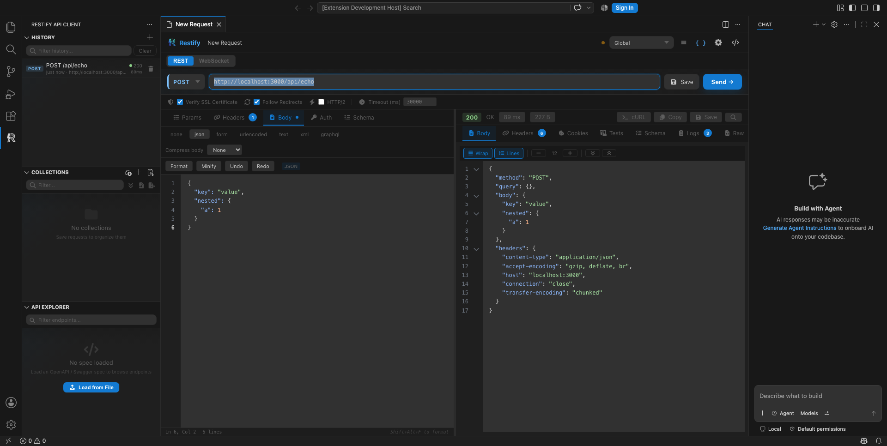

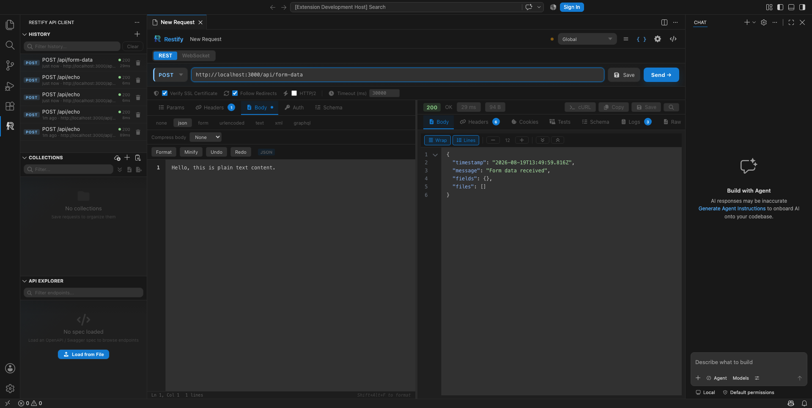

---

## Authentication

Restify supports 11 authentication methods. Select one from the Auth tab and fill in your credentials — Restify handles the header generation automatically.

**How to use:**

1. Click the **Auth** tab in the request pane.
2. Select your authentication method from the dropdown.
3. Fill in the required fields.
4. Send the request — the appropriate `Authorization` header is added automatically.

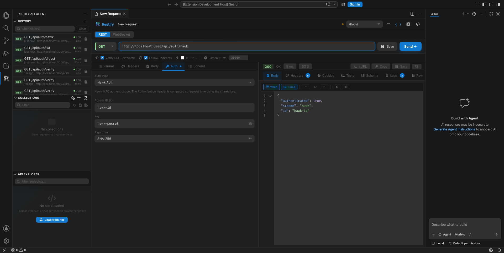

### Supported Methods

| Method | What to Fill In | What Restify Does |
|--------|-----------------|-------------------|
| **None** | — | No auth header is sent |
| **Bearer Token** | Paste your access token | Adds `Authorization: Bearer <token>` |
| **Basic Auth** | Enter username and password | Base64-encodes and adds `Authorization: Basic <credentials>` |
| **API Key** | Enter key name, value, and where to send it | Adds the key/value in headers or query params |
| **OAuth 2.0** | Configure grant type, client ID, secret, scopes | Obtains and caches the access token, refreshes automatically |
| **JWT** | Enter secret or private key, algorithm, issuer, subject | Signs a JWT and adds it as a Bearer token |
| **Digest Auth** | Enter username and password | Performs RFC 7616 digest challenge-response |
| **AWS SigV4** | Enter access key, secret key, session token, region, service | Signs using AWS Signature Version 4 |
| **Hawk** | Enter Hawk ID, key, algorithm (sha256/sha1) | Generates Hawk authentication headers |
| **NTLM** | Enter username, password, domain, workstation | Performs NTLM authentication handshake |
| **Inherit** | — | Inherits auth from the parent collection |

---

## Response Viewer

After sending a request, the response appears in the right pane of the request panel.

### Response Body

**How to use:**

1. Send a request to see the response.
2. The **Body** tab is selected by default — the response is automatically formatted.
3. Use the **search icon** to find text within large responses (supports JSONPath mode).
4. Click **Copy as cURL** to get a terminal-ready curl command.
5. Use the toolbar to toggle **line numbers**, **word wrap**, adjust **font size**, and **collapse/expand** code folds.

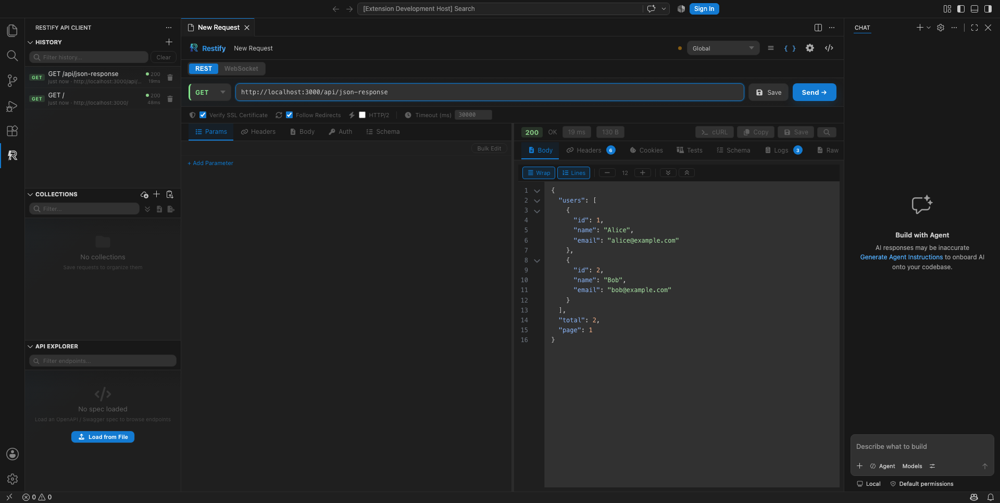

### Response Headers

The **Headers** tab shows all response headers from the server as key/value pairs.

### Response Logs

The **Logs** tab shows a detailed breakdown: request URL, method, headers, body, response status, timing, and script output.


### Response Timeline

The **Timeline** tab shows a waterfall breakdown: DNS Lookup, TCP Connect, TLS Handshake, TTFB, Content Transfer, and Total Duration — each as a horizontal bar with duration and percentage.

### Response Info Bar

| Field | Description |
|-------|-------------|
| **Status code** | Color-coded: green (2xx), yellow (3xx), red (4xx/5xx) |
| **Response time** | Total duration in milliseconds |
| **Response size** | Body size in bytes |

### File Previews

| File Type | How It Works |
|-----------|-------------|
| **CSV** | Parsed and displayed as a scrollable table |
| **Excel (XLS/XLSX)** | Multi-sheet table with cell formatting and sheet tabs |
| **PDF** | Bundled PDF renderer (no external CDNs) |
| **Plain text** | Rendered inline |

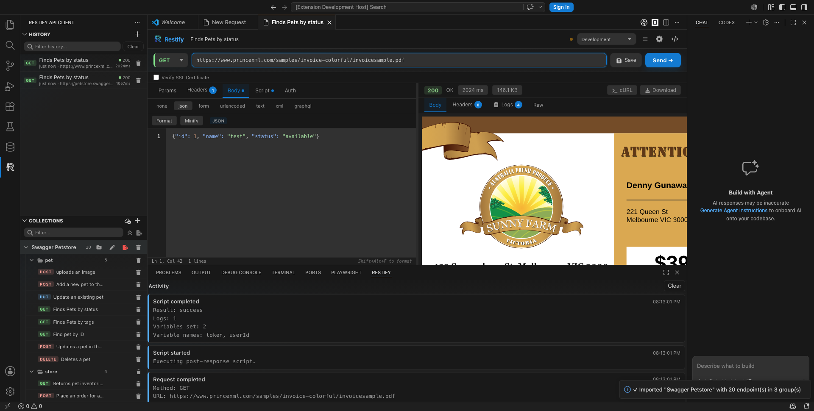

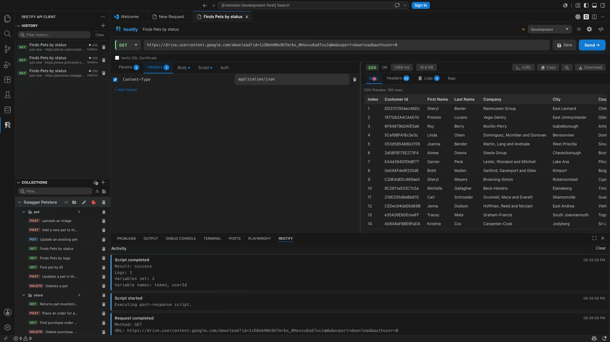

> **Note:** In-webview previews are capped at **5 MB**. Larger files show a download prompt.

---

## Collections

Collections let you save, organize, and reuse requests.

### Create a Collection

1. Open the **Collections** panel in the sidebar.
2. Click the **+** button in the panel header.
3. Enter a name (e.g., "User API", "Auth Service").

### Save a Request

1. Build your request (URL, headers, body, auth).
2. Press `Ctrl+S` / `Cmd+S` or click the **Save** button.
3. Enter a name, select a collection and optional folder, click **Save**.

### Organize with Folders

1. Hover over a collection, click the **folder icon**.
2. Enter a folder name.
3. Folders can be **nested** — drag a folder into another folder.

### Drag and Drop

1. **Grab** a request by its drag handle (grip icon on the left).
2. **Drag** to reorder within the same folder.
3. **Drag** to a different folder or collection header to move it.

### Run a Collection

1. Hover over a collection or folder, click the **play button**.
2. Requests execute sequentially with the collection's variables and scripts.
3. A results modal shows status, duration, and pass/fail for each request.
4. Optionally provide **iteration data** (CSV/JSON) for data-driven runs.

### Collection-Level Variables and Scripts

1. Click the **list icon** on a collection to set shared variables.
2. Click the **code icon** to set pre-request and test scripts.
3. Scripts run in order: collection pre-request → request pre-request → request tests → collection tests.


---

## Import & Export

### Import a Collection

1. Click the **import icon** in the Collections panel header (or run **"Restify: Import Collection"**).
2. Select your import source from the quick pick.
3. For file-based sources, select your file. For URL-based, paste the URL.
4. Restify parses and creates a collection with organized folders.
5. A notification confirms the import.

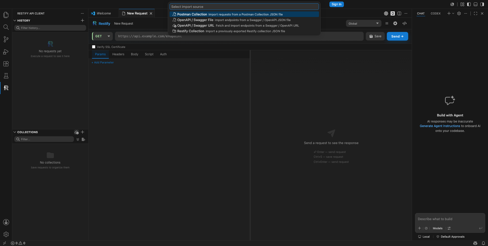


### Step-by-Step: Import Swagger from URL

1. Run **"Restify: Import Collection"**.
2. Select **"OpenAPI / Swagger URL"**.
3. Paste the spec URL (e.g., `https://petstore.swagger.io/v2/swagger.json`).
4. Restify fetches, parses, and creates a collection with folders per tag.

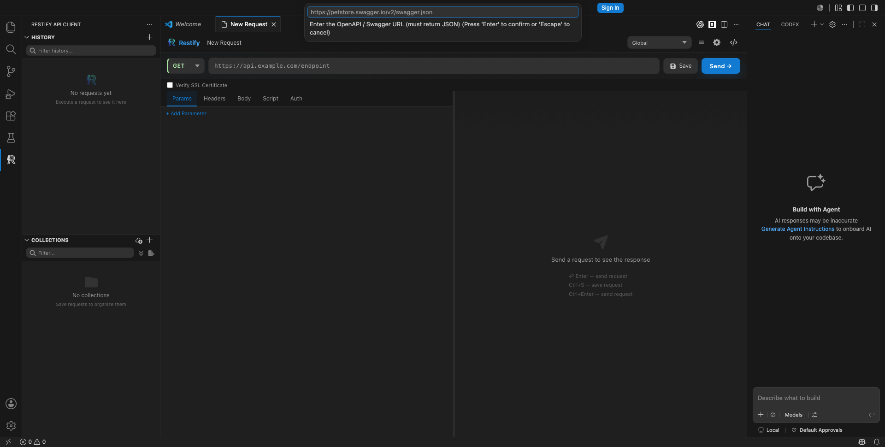

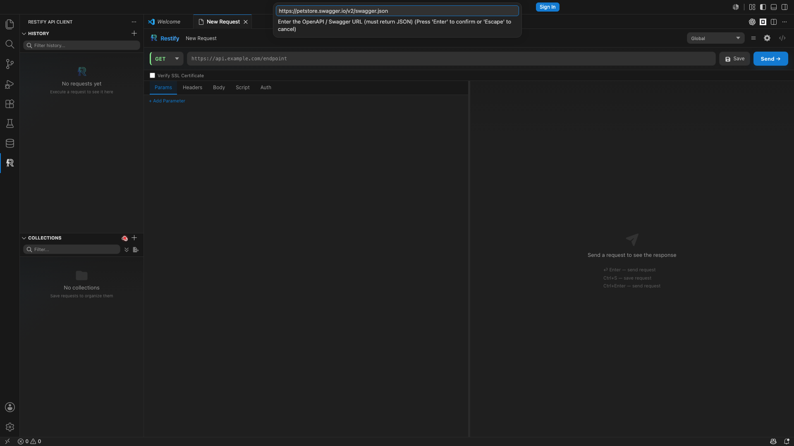


### Supported Import Formats

| Source | What Gets Imported |
|--------|-------------------|
| **Postman Collection** | Requests, folders, headers, body, auth |
| **OpenAPI / Swagger (file)** | Endpoints grouped by tag, with sample bodies from schemas |
| **OpenAPI / Swagger (URL)** | Same as above, fetched from a URL |
| **WSDL / SOAP (file)** | SOAP operations with generated XML envelopes |
| **WSDL / SOAP (URL)** | Same as above, fetched from a URL |
| **HAR** | Request/response pairs from browser network exports |
| **Insomnia** | Requests and folders from Insomnia exports |
| **REST Client .http** | Requests from `.http` files |
| **cURL** | Parsed cURL commands |
| **Restify JSON** | Previously exported Restify collections |

### Export a Collection

1. Hover over a collection, click the **export icon**.
2. Choose format: Restify JSON, Postman, OpenAPI 3.0, HAR, or .http.
3. Choose a save location and click **Save**.

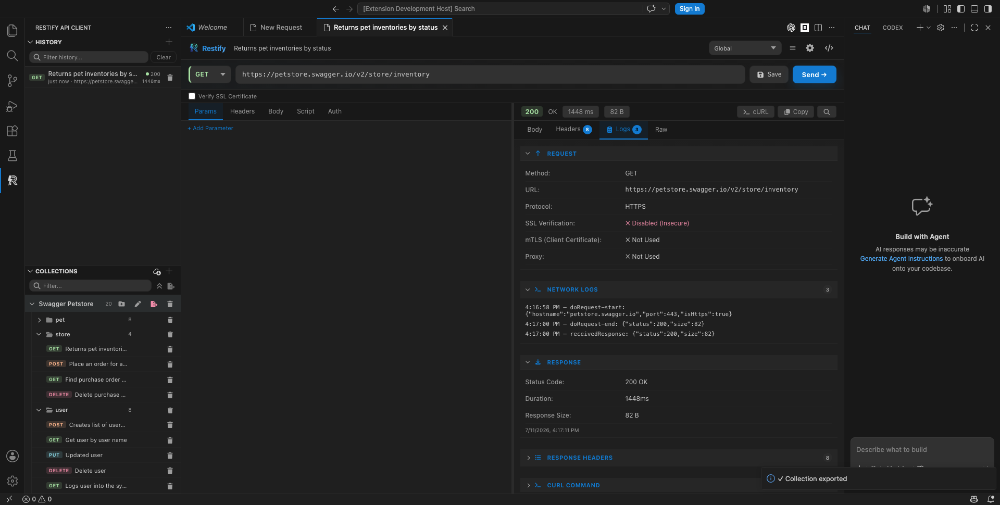

---

## OpenAPI / Swagger Explorer

### Load a Spec

1. Click the **API Explorer** view in the sidebar.
2. Click **"Load from File"** or **"Load from URL"**.
3. The spec loads with title, version, base URL, and endpoints grouped by tag.

### Browse Endpoints

1. Expand a **tag group** to see endpoints.
2. Each shows its HTTP method (color-coded), path, and summary.
3. **Click any endpoint** to open it in the request builder pre-filled from the spec.

### Import as Collection

1. After loading a spec, click **"Import as Collection"**.
2. The spec is saved as a collection with folders per tag and pre-filled request bodies.

---

## Environments & Variables

### Create an Environment

1. Click the **environment dropdown** at the top of the request panel.
2. Select **"Manage Environments"**.
3. Click **"+ New Environment"**, name it, add key/value pairs.
4. Click **Save** and close.


### Use Variables

1. Reference variables using `{{variableName}}` in URLs, headers, or body.
2. Variable names turn **green** when resolved, **red** when not found.
3. Switch environments using the dropdown — all variables update instantly.

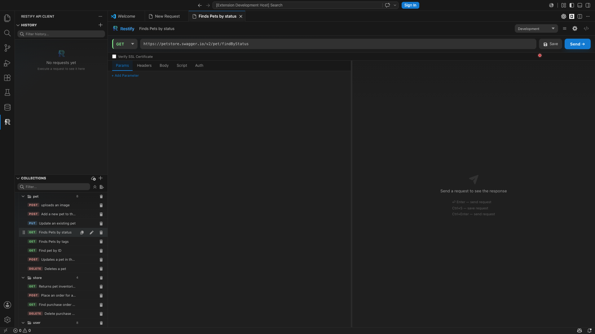

### Variable Scoping (highest wins)

1. **Local** — set by scripts or request chaining
2. **Environment** — values from the active environment
3. **Collection** — variables set on the parent collection
4. **Global** — built-in dynamic variables

### Secret Variables

1. In the environment manager, click the **shield icon** to mark a variable as secret.
2. Secret values are masked in the UI and never logged.
3. Values are stored encrypted in VS Code's SecretStorage.

### Initial vs Current Value

- **Initial Value** — the baseline (persists across sessions)
- **Current Value** — the active value used in requests
- Click **Reset** to copy initial → current. Click **Persist** to save current → initial.

---

## Code Generation

1. Build your request (method, URL, headers, body, auth).
2. Click the **code icon** (`< >`) in the top bar.
3. Select your target language from the dropdown.
4. Click the **copy icon** to copy the snippet.

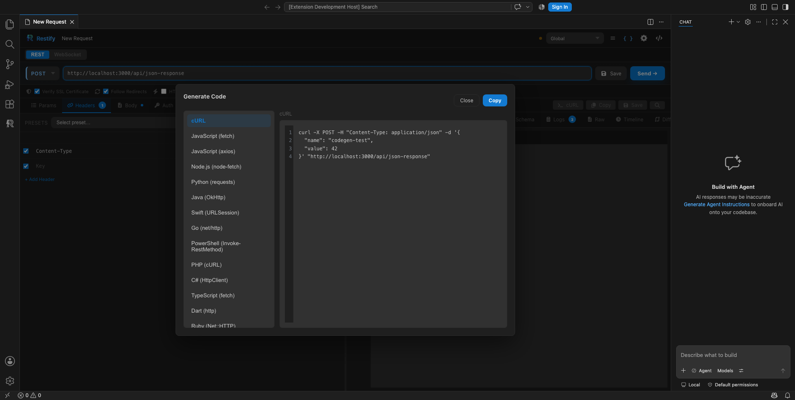

| Language | Library |
|----------|---------|
| **cURL** | Shell command |
| **JavaScript** | `fetch` / `axios` |
| **Node.js** | `node-fetch` |
| **Python** | `requests` |
| **Java** | `OkHttp` |
| **Swift** | `URLSession` |
| **Go** | `net/http` |
| **PowerShell** | `Invoke-RestMethod` |
| **PHP** | `cURL` |
| **C#** | `HttpClient` |

---

## Pre/Post Scripts & Test Assertions

### Pre-Request Scripts

Run before the request is sent. Use `vars` to set variables, `log(...)` for output.

```javascript
vars['timestamp'] = new Date().toISOString();
vars['requestId'] = {{$guid}};
```

### Post-Response Scripts & Test Assertions

Run after the response is received. Use `pm` (Postman-compatible API), `response`, `vars`.

**Example — Extract a token:**

```javascript
const data = JSON.parse(response.body);
vars['token'] = data.access_token;
```

**Example — Test assertions:**

```javascript
pm.test('Status is 200', () => {
  pm.response.to.have.status(200);
});

pm.test('Response has users array', () => {
  const body = pm.response.json();
  pm.expect(body).to.have.property('users');
  pm.expect(body.users).to.be.an('array');
});
```

### Available `pm` API

| Method | Description |
|--------|-------------|
| `pm.test(name, fn)` | Define a named test assertion |
| `pm.expect(value)` | Start an assertion chain (chai-style) |
| `pm.response.json()` | Parse response body as JSON |
| `pm.response.text()` | Get response body as text |
| `pm.response.to.have.status(code)` | Assert status code |
| `pm.response.to.have.header(name, value)` | Assert response header |


> **Tip:** Collection-level scripts run before/after every request in that collection.

---

## Request Chaining

Pass variables between requests within the same window session.

1. In a post-response script, use `vars['key'] = value` to store a value.
2. In any subsequent request, reference it as `{{key}}`.
3. Chained variables are scoped to the current window.

```javascript
// Login request post-response script:
const data = JSON.parse(response.body);
vars['authToken'] = data.token;
```

```
// Subsequent requests use {{authToken}} in headers:
Authorization: Bearer {{authToken}}
```

---

## Dynamic Variables

Generate random or computed values on each request using `{{$variableName}}` syntax.

| Variable | Description | Example Output |
|----------|-------------|----------------|
| `{{$guid}}` | Random UUID v4 | `a1b2c3d4-e5f6-7890-abcd-ef1234567890` |
| `{{$timestamp}}` | Current Unix timestamp | `1700000000` |
| `{{$randomInt}}` | Random integer (0-1000) | `472` |
| `{{$randomAlpha}}` | Random alphabetic string | `xkqjmfvp` |
| `{{$localDateTime}}` | Current local date/time | `2024-01-15T10:30:00` |

---

## JSON Schema Validation

Validate JSON responses against a JSON Schema (draft-07).

1. Send a request that returns JSON.
2. Click the **Schema** tab in the response pane.
3. Toggle **Validate** on and paste a JSON Schema.
4. Restify shows **Valid** (green) or lists validation errors (red).

> **Tip:** When importing an OpenAPI spec, response schemas are auto-attached for validation.

---

## JSONPath Query

Query JSON response bodies using JSONPath expressions.

1. Send a request that returns JSON.
2. In the response search bar, switch to **JSONPath** mode.
3. Enter an expression (e.g., `$.users[0].name`).

| Expression | Description |
|------------|-------------|
| `$` | Root object |
| `.name` | Property access |
| `[0]` | Array index |
| `[*]` | All array elements |
| `..name` | Recursive descent |
| `[?(expr)]` | Filter expressions |

---

## SOAP / WSDL

### Import a WSDL

1. Run **"Restify: Import Collection"**.
2. Select **"WSDL / SOAP Service"** (file) or **"WSDL / SOAP URL"**.
3. Restify parses the WSDL, creates folders per service, and generates SOAP envelopes.

### WS-Security

1. Open **Settings** → **SOAP Security**.
2. Add a hostname entry with username/password.
3. Enable **UsernameToken**, **Encrypt**, or **Decrypt** as needed.

---

## WebSocket Client

### Connect

1. Click the **type toggle** above the URL bar, select **WebSocket**.
2. Enter the WebSocket URL (e.g., `wss://echo.websocket.org`).
3. Click **Connect**.

### Send and Receive

1. Type a message and press **Enter** or click **Send**.
2. Incoming messages appear in the log with timestamps and direction indicators.
3. Binary messages are displayed in hex format.

---

## Header Presets

1. Click the **Headers** tab.
2. Add headers you want to save.
3. Click **"Save as Preset"** in the Presets bar, enter a name.
4. To apply: select a preset from the dropdown — headers are merged into the request.

---

## Mock Server

1. Run **"Restify: Start Mock Server"** from the Command Palette.
2. Select a collection to mock.
3. The server starts on `http://localhost:3000`.
4. Requests match routes from your collection and return configured responses.
5. Run **"Restify: Stop Mock Server"** to shut down.

---

## API Documentation Generation

1. Run **"Restify: Generate API Documentation"** from the Command Palette.
2. Select a collection.
3. Restify generates Markdown/HTML docs with endpoints, parameters, headers, body schemas, and examples.

---

## Settings

Click the **gear icon** (top right of the request panel) to open Settings.


### Proxy Configuration

1. Enter **Proxy Host** and **Port**.
2. Optionally add **Proxy Authorization** (username:password).
3. Add **No Proxy Hosts** — comma-separated hostnames that bypass the proxy.

### Client Certificates (mTLS)

1. Click **"+"** in the **Certificates** section.
2. Enter **Hostname**, **Certificate Path**, **Key Path**, and optionally **CA Path**.
3. Certificates are matched by hostname automatically.

### SSL Settings

- **Verify SSL Connection** checkbox below the URL bar.
- **Disabled** allows self-signed or untrusted certificates.

### Other Settings

| Setting | Description |
|---------|-------------|
| **Default Timeout** | Per-request timeout (default: 30,000ms) |
| **Long Request Threshold** | Notify when a request exceeds a duration |
| **Default Headers** | Inject User-Agent, Request ID, Correlation ID, Date, or custom headers |
| **Response Viewer** | Toggle line numbers, word wrap, font size |
| **Response Cache** | Cache responses for offline replay with configurable TTL |
| **Request Chaining** | Enable scripts to pass variables between requests |
| **Retry & Logging** | Auto-retry on failure, HTTP log output channel |

---

## Activity Log

The Activity panel shows real-time request lifecycle events: starts, completions, errors, and script output.

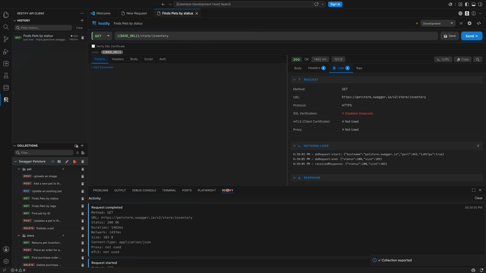

---

## Keyboard Shortcuts

| Action | Shortcut |
|--------|----------|
| Send request | `Enter` (URL bar) or `Ctrl+Enter` (anywhere) |
| Save request | `Ctrl+S` / `Cmd+S` |
| Format body (JSON/XML) | `Shift+Alt+F` |
| Close search / modal | `Esc` |
| Open Command Palette | `Ctrl+Shift+P` / `Cmd+Shift+P` |
| Open Extensions | `Ctrl+Shift+X` / `Cmd+Shift+X` |

---

## Contributing

```bash
git clone https://github.com/ashish-bhavsar-aws/restify-vscode.git
cd restify-vscode
npm install
npm run compile        # build
npm run lint           # lint
npm run test:unit      # unit tests
npm run guardrails     # boundary checks
```

### Project Structure

```
restify-vscode/
├── src/
│   ├── core/          # Request engine, auth, converters (no vscode imports)
│   ├── panels/        # VS Code panel providers and sidebar logic
│   ├── storage/       # Persistence layer (globalState)
│   └── webview/       # React UI components and styles
├── server/            # Built-in mock server
├── test/
│   ├── specs/         # E2E tests (Playwright + VS Code Electron)
│   └── unit/          # Unit tests (Vitest)
└── media/             # Icons and screenshots
```

---

## License

MIT
