# Restify — REST API Client for VS Code

A fast, lightweight REST API client built right into VS Code. Test APIs, debug endpoints, and manage requests without ever leaving your editor.

---

## Table of Contents

- [Getting Started](#getting-started)
- [Sidebar & Views](#sidebar--views)
- [Request Builder](#request-builder)
  - [URL & Method](#url--method)
  - [Query Parameters](#query-parameters)
  - [Headers](#headers)
  - [Request Body](#request-body)
  - [Scripts](#scripts)
  - [Authentication](#authentication)
- [Response Viewer](#response-viewer)
  - [Response Tabs](#response-tabs)
  - [File Previews](#file-previews)
- [Code Generation](#code-generation)
- [Environments & Variables](#environments--variables)
- [Collections](#collections)
- [Request History](#request-history)
- [Settings](#settings)
  - [Proxy Configuration](#proxy-configuration)
  - [Client Certificates (mTLS)](#client-certificates-mtls)
  - [SSL Settings](#ssl-settings)
- [Keyboard Shortcuts](#keyboard-shortcuts)

---

## Getting Started

1. **Install Restify** from the VS Code Extensions Marketplace
2. **Open Restify** using any of these methods:
   - **Sidebar icon** — click the Restify icon in the Activity Bar (left sidebar) to open the panel
   - **Command Palette** — press `Ctrl+Shift+P` / `Cmd+Shift+P` and search for "Restify: Open"
3. The main request panel opens automatically — you're ready to test APIs

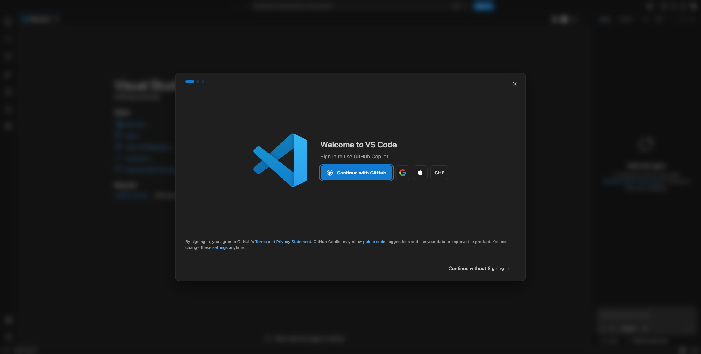

---

## Sidebar & Views

The Restify sidebar contains two collapsible panels:

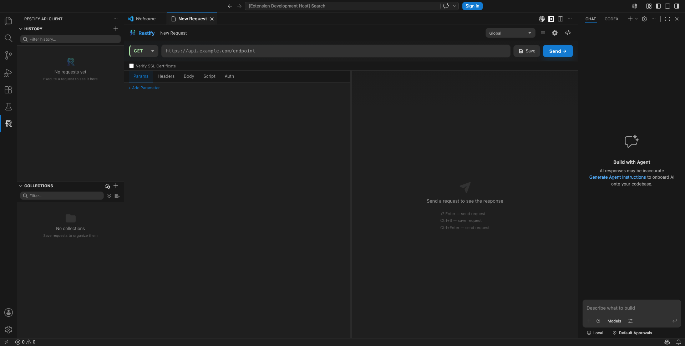

### History

- Shows your last **25 executed requests** with method, URL, status code, and response time
- **Click** any entry to restore the full request and response
- **Save** an entry to a collection by clicking the "+" button on hover
- **Delete** individual entries or **clear all** history at once

### Collections

- Create and organize saved requests into named collections
- Supports **nested folders** for grouping related requests (e.g., Auth, Users, Products)
- **Drag and drop** requests between folders and collections
- **Copy, rename, or delete** requests via hover actions
- **Import/Export** collections as JSON for sharing with teammates

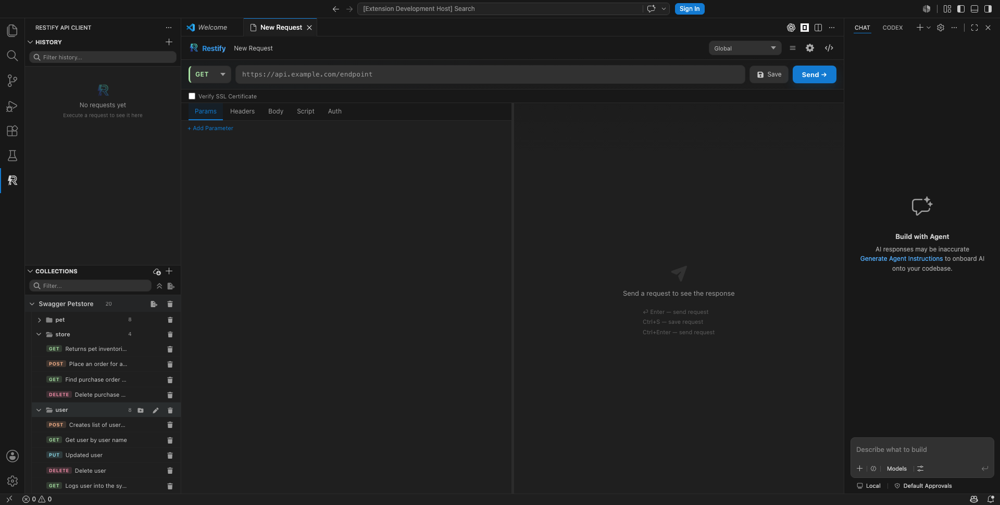

---

## Request Builder

### URL & Method

- **HTTP Method dropdown** — select from GET, POST, PUT, DELETE, PATCH, HEAD, or OPTIONS. Each method has a distinct color for quick recognition
- **Address bar** — paste or type your full URL. Environment variables like `{{baseUrl}}` are resolved automatically
- **Send** — click Send or press `Enter` while in the URL bar

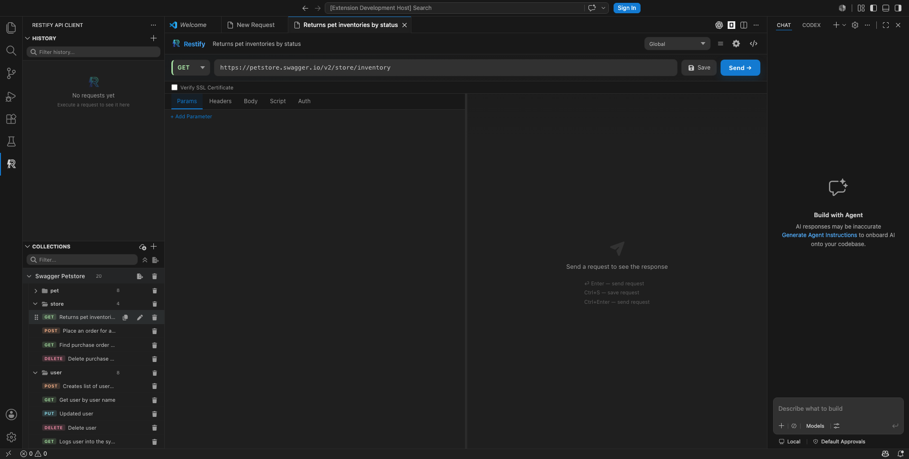

### Query Parameters

- **Type directly in the URL** — parameters you add to the URL auto-populate the Params table
- **Use the Params tab** — add key/value rows; they're reflected in the URL
- **Enable/disable** — toggle rows on/off without deleting them

### Headers

- **Autocomplete** — common header names (Content-Type, Authorization, etc.) and values (application/json, Bearer, etc.) are suggested as you type
- **Enable/disable** — toggle headers on/off without removing them

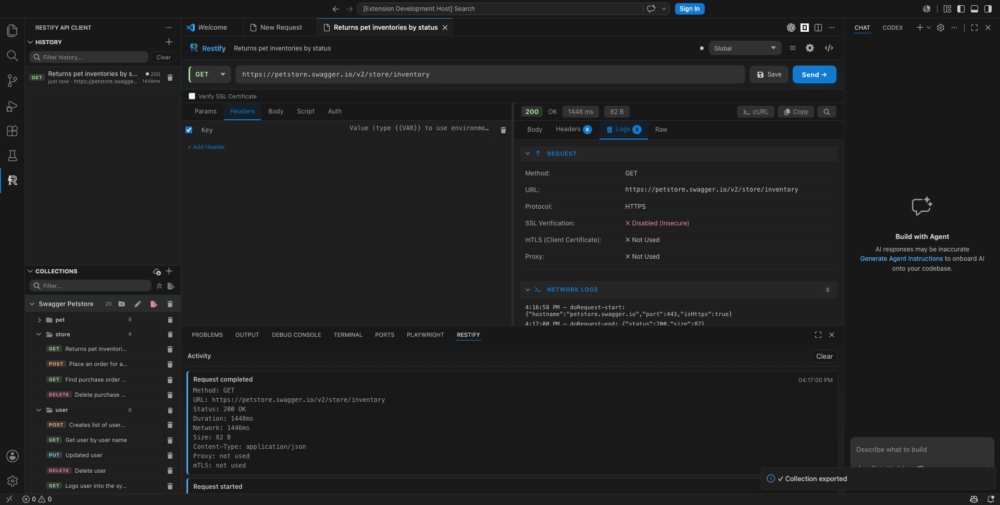

### Request Body

Choose from seven body formats:

| Format | Use Case |
|--------|----------|
| **None** | No body (typical for GET requests) |
| **JSON** | Structured data with syntax highlighting and auto-formatting |
| **XML** | XML-formatted payloads |
| **Text** | Raw text |
| **Form Data** | Key/value pairs with file upload support |
| **URL Encoded** | Standard form submission format |
| **GraphQL** | GraphQL queries and variables |

The body editor includes formatting options and auto-detects content type.

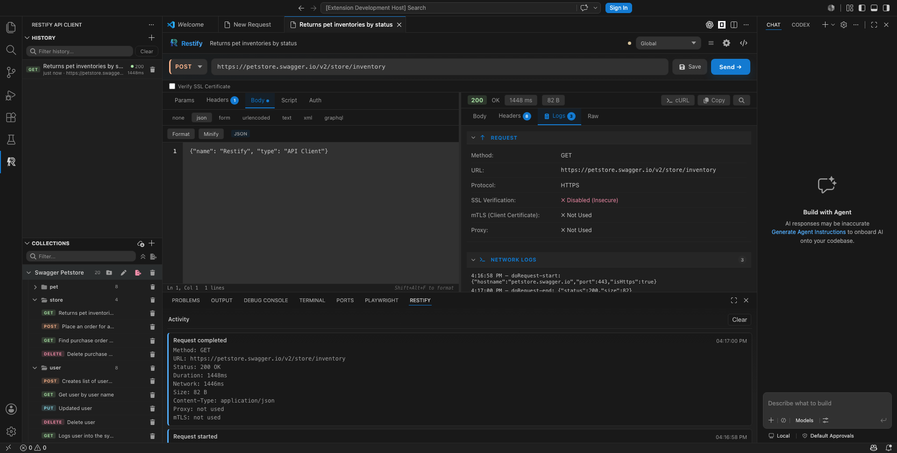

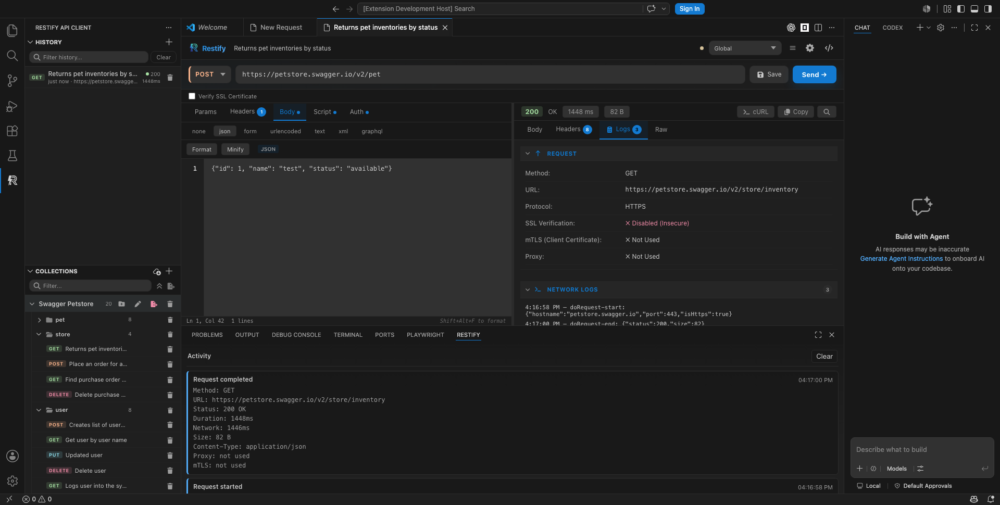

### Scripts

Write post-response scripts to automate workflows:

- **Extract values** from responses and store them as environment variables
- **Access response data** — `response.status`, `response.body`, `response.headers`, `response.rawBody`
- **Set variables** — `vars['token'] = response.body.access_token`
- **Log output** — `log(...)` writes to the Script Logs tab in the response pane

Scripts run in the extension host (not the webview) for full Node.js capabilities.

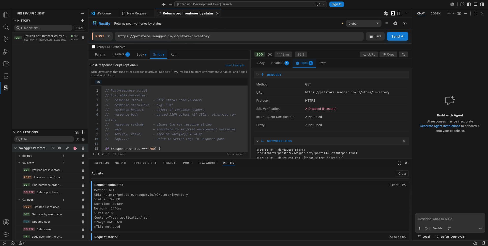

### Authentication

Choose your auth method — Restify handles the headers automatically:

| Method | Details |
|--------|---------|
| **None** | No authentication |
| **Bearer Token** | Paste an access token; `Authorization: Bearer <token>` is added automatically |
| **Basic Auth** | Enter username/password; Base64-encoded automatically |
| **API Key** | Key/value pair with option to send in headers or as a query parameter |

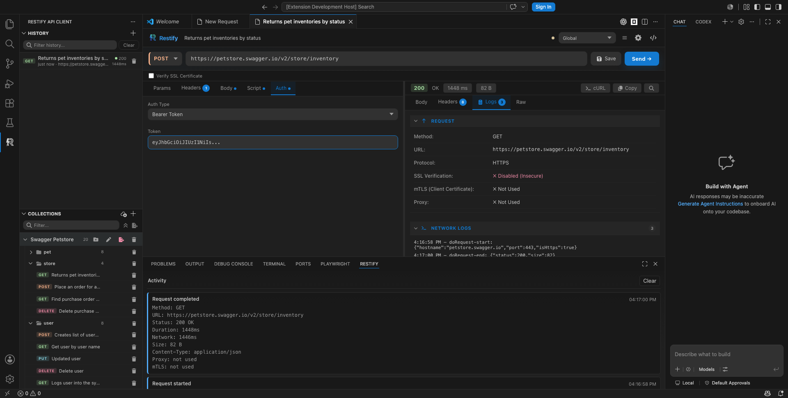

---

## Response Viewer

### Response Tabs

- **Body** — the main response data with automatic formatting (JSON syntax highlighting, XML pretty-printing)
- **Headers** — all response headers from the server
- **Logs** — detailed debug information: request/response breakdown, headers, parameters, and script logs
- **Raw** — the unformatted response output

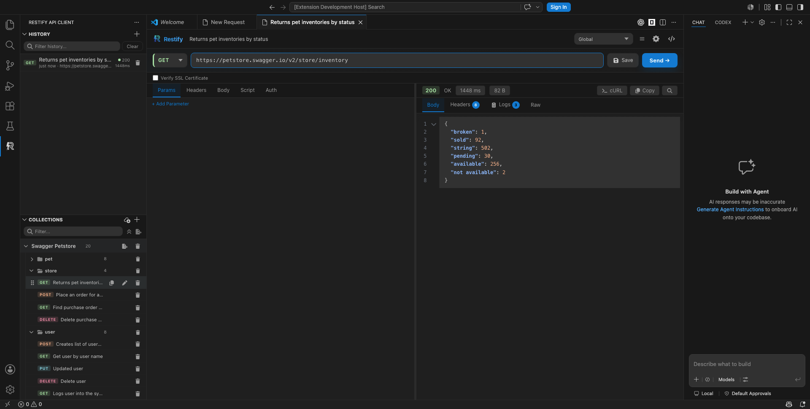

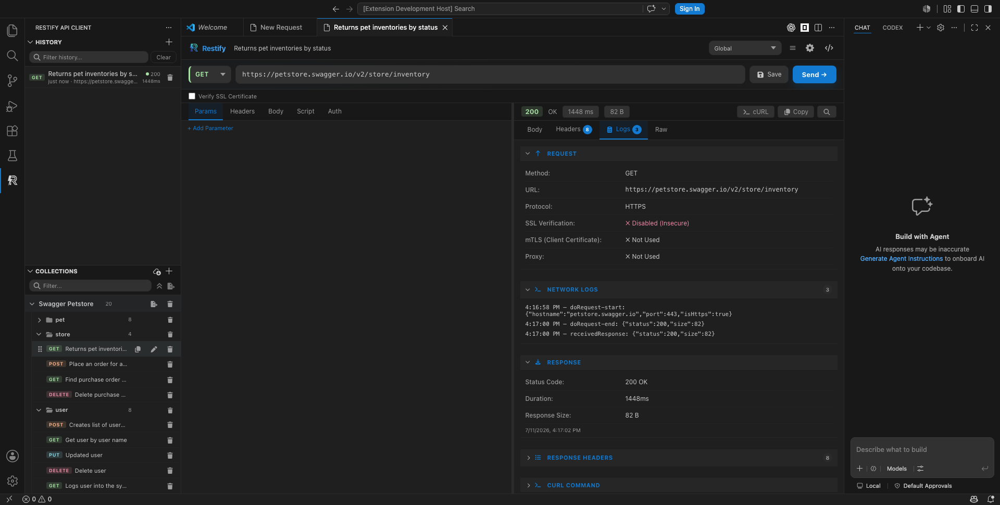

### Response Info

- **Status code** — displayed prominently (200 OK, 404 Not Found, 500 Server Error, etc.)
- **Response time** — how long the request took
- **Response size** — how much data was returned
- **Search** — click the search icon to find text within large responses
- **Copy as cURL** — copy a curl command to reproduce the same request from your terminal

### File Previews

Restify detects and previews common file types inline:

- **CSV** — parsed and displayed as a read-only table
- **Excel (XLS/XLSX)** — parsed and displayed as a table
- **Plain text** — rendered inline
- **PDF** — rendered using a bundled PDF renderer (no external CDNs)

**Limits:** In-webview previews are capped at **5 MB**. Files larger than this prompt a download. The Download button saves the binary to your chosen location.

---

## Code Generation

Turn any request into ready-to-run code snippets:

1. Build your request (method, URL, headers, body, auth)
2. Click the **code icon** (`< >`) in the top bar
3. Select a language from the dropdown
4. Copy the generated snippet

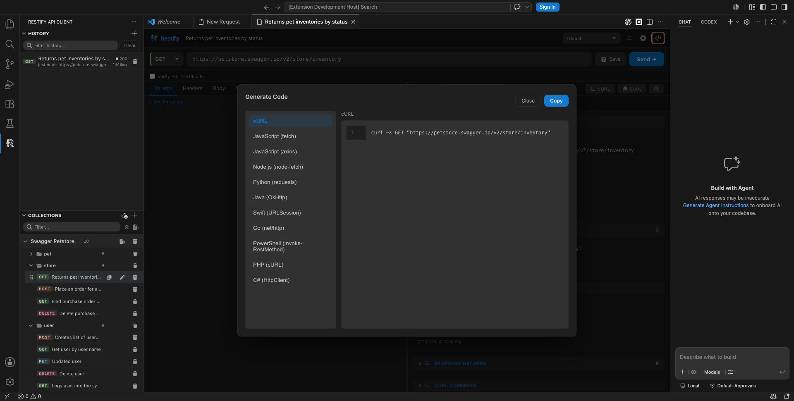

**Supported languages:**

- cURL
- JavaScript (fetch)
- JavaScript (axios)
- Node.js (node-fetch)
- Python (requests)
- Java (OkHttp)
- Swift (URLSession)
- Go (net/http)
- PowerShell (Invoke-RestMethod)
- PHP (cURL)
- C# (HttpClient)

Snippets reflect the full request state including method, URL, headers, body, and authentication.

---

## Environments & Variables

Environments store reusable values so you don't repeat yourself across requests.

### Create an Environment

1. Click the **environment dropdown** at the top of the request panel
2. Select **"Manage Environments"**
3. Click **"+ New Environment"**
4. Name it (e.g., "Development", "Production")
5. Add key/value pairs:
   - `baseUrl` = `https://api.example.com`
   - `token` = `abc123xyz`
6. Save

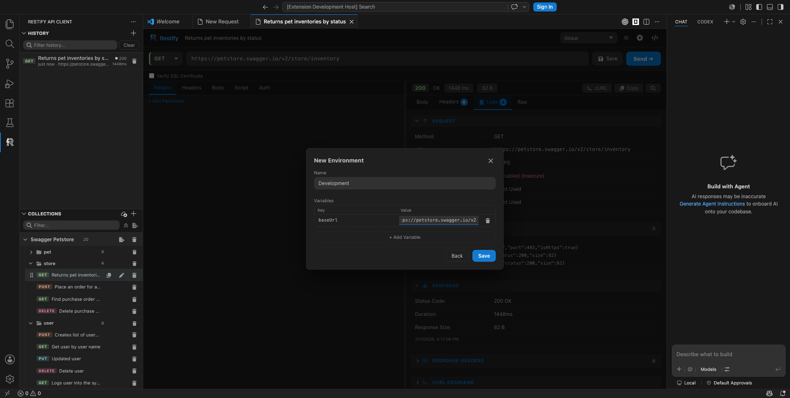

### Use Variables

Reference variables anywhere in your request using `{{variableName}}` syntax:

- **URLs** — `{{baseUrl}}/users`
- **Headers** — `Authorization: Bearer {{token}}`
- **Body** — `"username": "{{username}}"`

**Visual feedback:** variable names turn **green** if resolved, **red** if not found in the active environment.

### Switch Environments

- Use the **dropdown** at the top to switch instantly
- All `{{variable}}` references update automatically
- Select **"No Environment"** to disable variable resolution

---

## Collections

### Create a Collection

1. Open the **Collections** panel in the sidebar
2. Click the **"+"** button in the panel header
3. Name your collection

### Save a Request

1. Build your request (URL, headers, body, auth)
2. Click the **Save** button next to the URL bar
3. Name the request and choose a collection
4. Click **Save**

### Organize

- **Folders** — right-click a collection to add nested folders
- **Drag & drop** — move requests between folders and collections
- **Copy** — duplicate requests within a collection
- **Rename/Delete** — hover over a request for action buttons

### Import & Export

- **Export** a collection as JSON for backup or sharing
- **Import** a JSON file to restore or merge collections

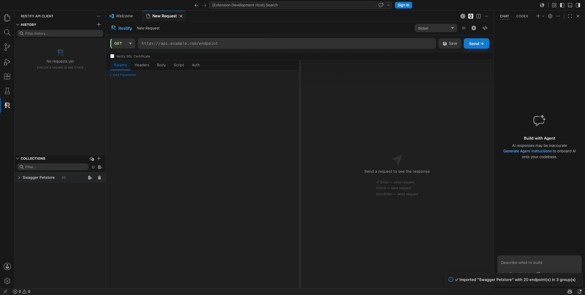

---

## Request History

Every request you send is automatically recorded:

- **Last 25 requests** are stored with full request/response data
- **Click** any entry to restore it instantly
- **Save to collection** by clicking the "+" on hover
- **Delete** entries individually or **clear all** at once

---

## Settings

Click the **gear icon** (top right of the request panel) to open Settings.

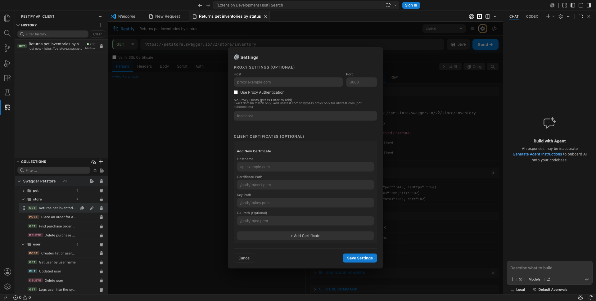

### Proxy Configuration

Route all requests through a proxy server:

- **Host** — proxy server address
- **Port** — proxy port number
- **Authentication** — optional username/password for proxy auth
- **No Proxy Hosts** — hostnames that bypass the proxy

### Client Certificates (mTLS)

For APIs requiring mutual TLS authentication:

- **Hostname** — the domain that requires the certificate
- **Certificate Path** — path to your certificate file
- **Key Path** — path to your private key file
- **CA Path** (optional) — path to a CA certificate

Certificates are matched by hostname and applied automatically.

### SSL Settings

- **Verify SSL Connection** checkbox (below the URL bar)
- **Enabled (default)** — strict certificate verification
- **Disabled** — allows self-signed or untrusted certificates (for testing only)

---

## Keyboard Shortcuts

| Action | Shortcut |
|--------|----------|
| Send request | `Enter` (in URL bar) or `Ctrl+Enter` (anywhere) |
| Save request | `Ctrl+S` |
| Format body (JSON/XML) | `Shift+Alt+F` |
| Close search | `Esc` |

---

## Overview

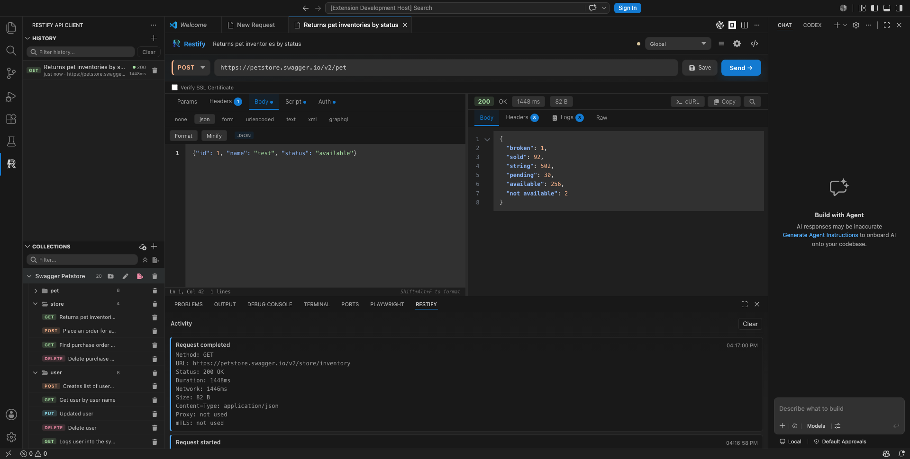
